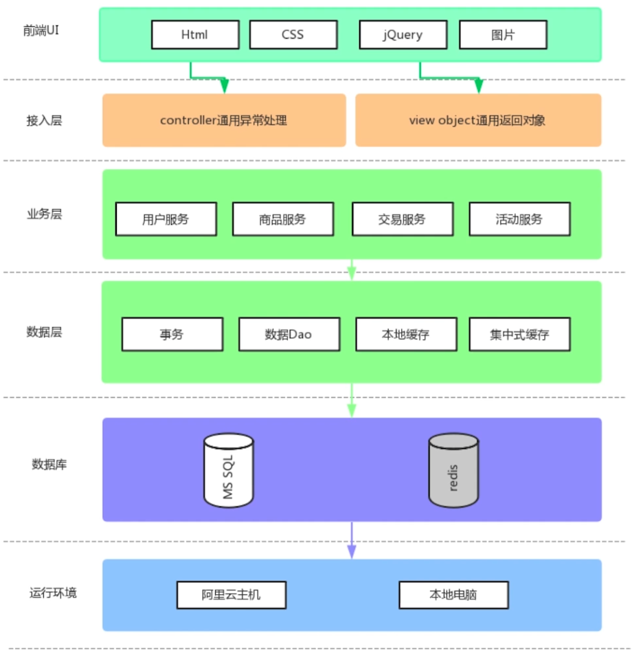

## 项目简介

项目是一个基于SpringBoot+MyBatis实现的基本的电商秒杀系统

使用了一个前后端分离的设计方式，前端UI使用了Html、CSS、jQuery以及Mytronic前端框架完成了用户注册、登录、商品展示、下单交易、秒杀倒计时等基本前端功能

接入层使用了SpringMVC的Controller定义了定义了对应的viewobject返回了通用的对象，并且在Controller层通过通用的异常处理的方式结合通用的返回对象，返回了对应的前后端分离的Json的DataStatus模型

业务层使用了MyBatis的接入和Model层领域模型的概念，完成了对应的用户服务、商品服务、交易服务、活动服务相关核心服务的Service层

在数据层使用了@Transactional的标签来完成事务的切面，使用数据库MyBatis的Dao来完成会数据的相关操作

## 资源

Mytronic框架：基于BootStrap的付费UI模板

框架放在了/html/static

项目重心在秒杀服务器，前端只是用了基本的Mytronic的css组件

## 出错调试

调试方式：断点调试、日志调试

确认问题点：环境问题、UI展示问题、接口问题、服务问题、配置问题

互联网寻找答案

## 拓展实现

多商品，多库存，多活动模型的实现方式

## 遗留问题

1. 如何支撑亿级别的流量

   部署在云端后怎样通过压测发现容量问题

2. 如何使得系统水平扩展

   一台机器支持100TPS，那么100台机器能支持10000TPS吗

3. 查询效率低下

   商品详情页listitem每次通过操作数据库拿到itemDO的方式进而拿到商品页面，对应的查询效率是否可以再提高

4. 活动开始前页面会被疯狂刷新

   刷新的接口设计到商品活动等所有模块的调用，这样的性能消耗没有任何意义

5. 库存行锁问题

   同一个事务只能对同一个数据进行减操作，其他的都得排队

6. 浪涌流量如何解决

   突然的流量达到峰值，又突然消失，使得缓存全部失效，并且涌入后端服务器中

7. 下单操作多，缓慢

